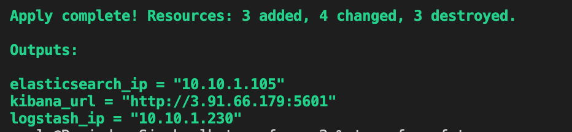
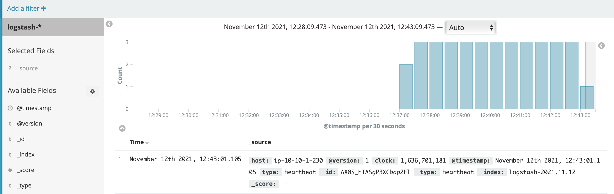

## Providers

| Name | Version |
|------|---------|
|  [aws](#provider\_aws) | 3.65.0 |
|  [template](#provider\_template) | 2.2.0 |

## Modules

| Name | Source | Version |
|------|--------|---------|
|  [security](#module\_security) | ./security | n/a |
|  [vpc](#module\_vpc) | ./vpc | n/a |

## Resources

| Name | Type |
|------|------|
| [aws_instance.elasticsearch](https://registry.terraform.io/providers/hashicorp/aws/latest/docs/resources/instance) | resource |
| [aws_instance.kibana](https://registry.terraform.io/providers/hashicorp/aws/latest/docs/resources/instance) | resource |
| [aws_instance.logstash](https://registry.terraform.io/providers/hashicorp/aws/latest/docs/resources/instance) | resource |
| [aws_key_pair.elk_auth](https://registry.terraform.io/providers/hashicorp/aws/latest/docs/resources/key_pair) | resource |
| [template_file.init_elasticsearch](https://registry.terraform.io/providers/hashicorp/template/latest/docs/data-sources/file) | data source |
| [template_file.init_kibana](https://registry.terraform.io/providers/hashicorp/template/latest/docs/data-sources/file) | data source |
| [template_file.init_logstash](https://registry.terraform.io/providers/hashicorp/template/latest/docs/data-sources/file) | data source |

## Inputs

| Name | Description | Type | Default | Required |
|------|-------------|------|---------|:--------:|
|  [aws\_amis](#input\_aws\_amis) | n/a | `map` | <pre>{   "us-east-1": "ami-083654bd07b5da81d" }</pre> | no |
|  [aws\_key\_name](#input\_aws\_key\_name) | Name of the AWS key pair | `string` | `"test"` | no |
|  [aws\_profile](#input\_aws\_profile) | aws profile | `string` | `"default"` | no |
|  [aws\_public\_key\_path](#input\_aws\_public\_key\_path) | Path to the SSH public key to be used for authentication. Ensure this keypair is added to your local SSH agent so provisioners can connect. Example: ~/.ssh/elk-terraform.pub | `string` | `"~/.ssh/id_rsa.pub"` | no |
|  [elasticsearch\_cluster](#input\_elasticsearch\_cluster) | Name of the elasticsearch cluster | `string` | `"elk_cluster"` | no |
|  [elasticsearch\_data\_dir](#input\_elasticsearch\_data\_dir) | n/a | `string` | `"/opt/elasticsearch/data"` | no |
|  [elk\_instance\_type](#input\_elk\_instance\_type) | n/a | `string` | `"m4.large"` | no |
|  [env](#input\_env) | n/a | `string` | `"dev"` | no |
|  [region](#input\_region) | AWS regione where launch servers | `string` | `"us-east-1"` | no |

## Outputs

| Name | Description |
|------|-------------|
|  [elasticsearch\_ip](#output\_elasticsearch\_ip) | n/a |
|  [kibana\_url](#output\_kibana\_url) | n/a |
|  [logstash\_ip](#output\_logstash\_ip) | n/a |

## KIBANA OUTPUT

